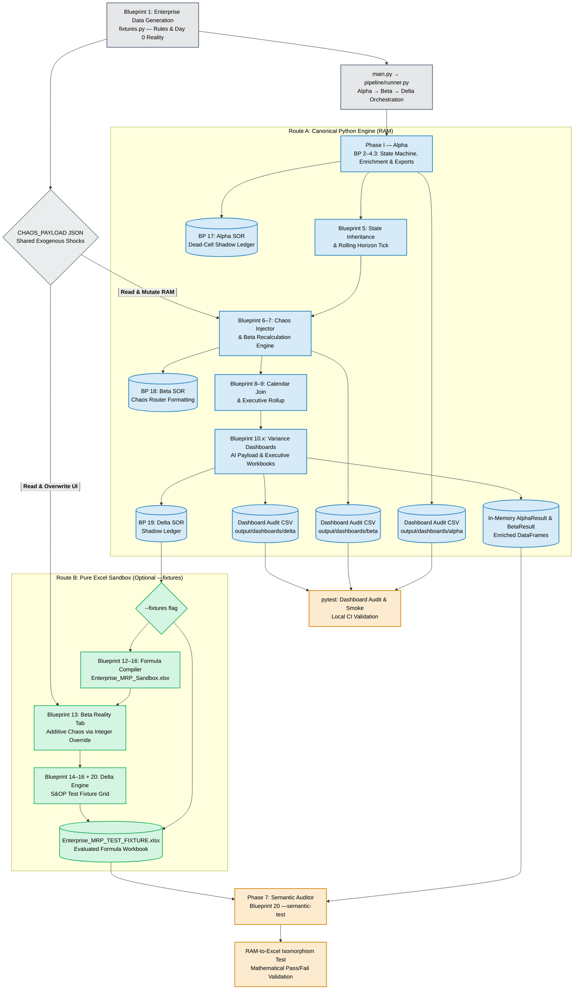

# Table of Contents

## Project Outline

- [Related Notes](#related-notes)
- [Documentation map](#documentation-map)
  - [Layer 4 validation targets](#layer4-validation-targets)
- [Project Outline](#project-outline)
- [The Pipeline](#the-pipeline)
- [Refactored Repository Architecture](#refactored-repository-architecture)
- [Phase 1: Engine Initialization & Baseline Generation](#phase-1-engine-initialization-baseline-generation)
  - [Blueprint 1: Enterprise Data Generation](#blueprint-1-enterprise-data-generation)
  - [Blueprint 2: Path-Dependent State Machine](#blueprint-2-path-dependent-state-machine)
  - [Blueprint 3: The Baseline Organizer (Financial Enrichment)](#blueprint-3-baseline-organizer-financial-enrichment)
  - [Blueprint 4.1: Raw Data & Complete Audit Trace](#blueprint-4-1-raw-data-complete-audit-trace)
  - [Blueprint 4.1.1: Purchasing Cadence Matrix](#blueprint-4-1-1-purchasing-cadence-matrix)
  - [Blueprint 4.2: The Visual Dashboard (Modular Upgrade)](#blueprint-4-2-visual-dashboard-modular-upgrade)
  - [Blueprint 4.3: Excel Deliverable](#blueprint-4-3-excel-deliverable)
- [Phase 2: State Inheritance & The Beta Engine](#phase-2-state-inheritance-beta-engine)
  - [Blueprint 5: State Inheritance & Time Shift](#blueprint-5-state-inheritance-time-shift)
  - [Blueprint 6: The Chaos Injector](#blueprint-6-chaos-injector)
  - [Blueprint 7: The Beta Recalculation Engine](#blueprint-7-beta-recalculation-engine)
- [Phase 2.b: The Beta Presentation Layer](#phase-2b-beta-presentation-layer)
- [Phase 3: Comparative Delta Engine](#phase-3-comparative-delta-engine)
  - [Blueprint 8: Absolute Calendar Join Engine](#blueprint-8-absolute-calendar-join-engine)
  - [Blueprint 9: Exception Organizer & Filter (Executive Rollup)](#blueprint-9-exception-organizer-executive-rollup)
- [Phase 4: The Delta Presentation Layer](#phase-4-delta-presentation-layer)
  - [Blueprint 10: AI Agent Payload & Supplier Comms](#blueprint-10-ai-agent-payload-supplier-comms)
  - [Blueprint 10.1: Comparative Dashboards (The Master Version)](#blueprint-10-1-comparative-dashboards)
  - [Blueprint 10.2: The Enterprise Excel Exporter (Upgraded)](#blueprint-10-2-enterprise-excel-exporter)
- [Phase 5: Excel Shadow Ledger](#phase-5-excel-shadow-ledger)
  - [Blueprint 17: Alpha System of Record (Dead Cells)](#blueprint-17-alpha-system-of-record)
  - [Blueprint 18: Beta System of Record (Day X)](#blueprint-18-beta-system-of-record)
  - [Blueprint 19: The Delta System of Record (Shadow Ledger)](#blueprint-19-delta-system-of-record)
- [Phase 6: Pure Excel Code](#phase-6-pure-excel-code)
  - [Blueprint 12-16: Interactive Excel Sandbox](#blueprint-12-16-interactive-excel-sandbox)
- [Phase 7: Excel vs Python Isomorphism Testing](#phase-7-excel-python-isomorphism-testing)
  - [Blueprint 20: CI/CD Test Fixture & Semantic Auditor](#blueprint-20-cicd-test-fixture-semantic-auditor)

## Technical Documentation

- [Technical Documentation](#technical-documentation)
- [CLI & Pipeline Orchestration](#cli-pipeline-orchestration)
- [Phase 1 — Technical](#phase-1-technical)
  - [Blueprint 1 — Technical: Enterprise Data Generation](#blueprint-1-technical)
  - [Blueprint 2 — Technical: Path-Dependent State Machine](#blueprint-2-technical)
  - [Blueprint 3 — Technical: Baseline Organizer](#blueprint-3-technical)
  - [Blueprint 4.2 — Technical: Visual Dashboard](#blueprint-4-2-technical)
- [Phase 2 — Technical](#phase-2-technical)
  - [Blueprint 5 — Technical: State Inheritance](#blueprint-5-technical)
  - [Blueprint 7 — Technical: Beta Recalculation](#blueprint-7-technical)
- [Phase 3 — Technical](#phase-3-technical)
  - [Blueprint 8 — Technical: Calendar Join](#blueprint-8-technical)
  - [Blueprint 9 — Technical: Executive Rollup](#blueprint-9-technical)
  - [Blueprint 10.2 — Technical: Campaign Compression](#blueprint-10-2-technical)
- [Output Artifacts Reference](#output-artifacts-reference)
- [Glossary 1: Supply Chain Physics (The MRP Business Logic)](#glossary-1-supply-chain-physics)
- [Glossary 2: Excel Engine Functions (The Syntax Mechanics)](#glossary-2-excel-engine-functions)
- [Architectural Transition: From Colab Notebook to Modular Pipeline](#architectural-transition)

# Related Notes

Conceptual context for this pipeline lives in the companion `notes` repo (open it alongside this repo in the Cursor multi-root workspace). These links resolve locally; they do not render on GitHub since the repos publish separately.

- [notes/meta/Meta_Workflow.md](../notes/meta/Meta_Workflow.md) — canonical 0-4 Centaur meta-workflow.
- [notes/meta/verification/Layer4_TypeB_Auditing.md](../notes/meta/verification/Layer4_TypeB_Auditing.md) — Type B auditing; conservation and state-machine invariants relevant to the Alpha/Beta/Delta timelines.
- [notes/meta/OR_AI_ASI.md](../notes/meta/OR_AI_ASI.md) — OR pillars and supply-planning examples (PAB, BOM DAG, capacity constraints).
- [notes/meta/orchestration/AI_Deterministic_Delegation.md](../notes/meta/orchestration/AI_Deterministic_Delegation.md) — architecture-first workflow for building deterministic MRP micro-engines.
- [docs/supply-planning/README.md](docs/supply-planning/README.md) — strategy docs (mirror of Notes supply-planning hub).
- [docs/supply-planning/frameworks/MRP_Invariant_Suite.md](docs/supply-planning/frameworks/MRP_Invariant_Suite.md) — Layer 4 invariant suite for the implemented Alpha/Beta/Delta engine (zero-chaos ⇒ Δ≡0, mass balance, inheritance gluing, chaos support, determinism, export round-trip).
- [notes/projects/mrp/README.md](../notes/projects/mrp/README.md) — project note index.
- [notes/projects/mrp/supply-planning/architecture/MRP_State_Machine_Architecture.md](../notes/projects/mrp/supply-planning/architecture/MRP_State_Machine_Architecture.md) — sequential state machine vs vectorized trap (Blueprint 2 foundation).
- [notes/projects/mrp/supply-planning/roadmaps/MRP_V2_Roadmap.md](../notes/projects/mrp/supply-planning/roadmaps/MRP_V2_Roadmap.md) — V2 engine evolution: multi-echelon, cost optimization, dynamic SS.
- [notes/projects/mrp/supply-planning/frameworks/Two_Dials_Framework.md](../notes/projects/mrp/supply-planning/frameworks/Two_Dials_Framework.md) — macro/micro decoupling and peace/war closed-loop workflow.
- [notes/projects/mrp/supply-planning/roadmaps/Supply_Planning_Tool_Roadmap.md](../notes/projects/mrp/supply-planning/roadmaps/Supply_Planning_Tool_Roadmap.md) — battleship vs speedboats narrative; links to phased blueprints.
- [notes/projects/mrp/supply-planning/blueprints/SP_RM_Phase1.md](../notes/projects/mrp/supply-planning/blueprints/SP_RM_Phase1.md) — Speedboat phase blueprints with Layer 4 invariants.
- [notes/projects/mrp/supply-planning/context/SAP_Enterprise_Context.md](../notes/projects/mrp/supply-planning/context/SAP_Enterprise_Context.md) — SAP IBP/PP/MM mapping (optional enterprise reference).
- [notes/math/supply-planning/Math_Safety_Stock_Derivation.md](../notes/math/supply-planning/Math_Safety_Stock_Derivation.md) — DDLT, safety stock, infinity clash.
- [notes/math/supply-planning/Math_Supply_Planning_OR_Lexicon.md](../notes/math/supply-planning/Math_Supply_Planning_OR_Lexicon.md) — OR lexicon and MILP foundations.

## Documentation map

Three strategy documents use overlapping vocabulary but describe different scopes. Do not conflate their phase numbers.

**Pipeline Phases 1–7** (this document) describe the shipped Alpha → Beta → Delta simulation: baseline generation, chaos recalculation, variance rollups, Excel shadow ledgers, and Python–Excel isomorphism testing. This is what `main.py` runs today.

**Speedboat Phases 1–5** ([SP_RM_Phase1.md](../notes/projects/mrp/supply-planning/blueprints/SP_RM_Phase1.md) … [Phase5](../notes/projects/mrp/supply-planning/blueprints/SP_RM_Phase5.md); narrative in [Supply_Planning_Tool_Roadmap.md](../notes/projects/mrp/supply-planning/roadmaps/Supply_Planning_Tool_Roadmap.md)) describe standalone Python supply-planning tools built beside the pipeline: sandbox MRP → BOM DAG tracer → micro/horizon/portfolio MILP optimizers. Most of this is future work.

**MRP V2** ([MRP_V2_Roadmap.md](../notes/projects/mrp/supply-planning/roadmaps/MRP_V2_Roadmap.md)) describes forward-looking engine features (multi-echelon BOM explosion, dynamic safety stock, cost optimization, capacity underutilization). These extend Blueprint 2 physics but are not fully implemented.

**Rough mapping:** Pipeline Phase 1 / Blueprint 2 ≈ Speedboat Phase 1 (sequential sandbox MRP). Speedboat Phases 2–5 and most V2 items are not yet in the codebase.

### Layer 4 validation targets

Validation backlog from [SP_RM blueprints](../notes/projects/mrp/supply-planning/blueprints/SP_RM_Phase1.md). Not yet enforced in `mrp_pipeline` tests/schemas.

| Phase | Invariants to enforce in `mrp_pipeline` tests/schemas |
|-------|------------------------------------------------------|
| 1 — Sandbox MRP | Conservation of mass; non-negativity; lead-time offset; MOQ modulo |
| 2 — DAG tracer | Topological acyclicity; quantity-per conservation; nilpotent BOM matrix |
| 3 — Micro MILP | Capacity bound audit; integer floor; $Z_{MILP} \le Z_{MRP}$; complementary slackness |
| 4 — Horizon MILP | Terminal state $\ge SS$; frozen-zone POR lock |
| 5 — Portfolio MILP | Mutually exclusive setup binaries; setup triangle inequality |

When dynamic safety stock lands, also enforce $ROP = E[DDLT] + SS$ per [Math_Safety_Stock_Derivation.md](../notes/math/supply-planning/Math_Safety_Stock_Derivation.md).

# Project Outline

## The Pipeline

**Code:** [`main.py`](main.py) · [`pipeline/runner.py`](pipeline/runner.py)

**Legacy reference:** [`legacy/project_code.py`](legacy/project_code.py) · [`legacy/Project_Documentation.md`](legacy/Project_Documentation.md)

This project implements a **24-month Master Resource Planning (MRP) simulation** that progresses through three deterministic timelines:

| Timeline | Name | Objective |
|----------|------|-----------|
| **Alpha** | Day 0 Baseline | Unconstrained plan from starting master data |
| **Beta** | Day X Reality | Rolling horizon + chaos mutations + recalculation |
| **Delta** | Variance Engine | Compare Alpha vs Beta; roll up executive actions |

> **CLI:** `py -X utf8 main.py --phase full` runs Route A. Add `--fixtures` for Route B; add `--semantic-test` (requires fixtures) for Phase 7. Excel formulas must be evaluated (open workbook in Excel and save) before the semantic audit.

The refactored codebase preserves the original **Blueprint** numbering and business logic from the Colab notebook, but organizes each blueprint into importable Python modules with explicit orchestration via the CLI.

---

## Refactored Repository Architecture

*Objective: Run the full pipeline reproducibly without notebook-style side effects.*

### Module Map

| Blueprint domain | Module path |
|------------------|-------------|
| Static data & chaos payload | [`data/fixtures.py`](data/fixtures.py) |
| Calendar horizon | [`mrp/calendar.py`](mrp/calendar.py) |
| SKU state machine (Alpha/Beta physics) | [`mrp/simulation.py`](mrp/simulation.py) |
| Inheritance & chaos injection | [`mrp/state.py`](mrp/state.py) |
| Financial enrichment & health metrics | [`mrp/enrichment.py`](mrp/enrichment.py) |
| Join, exceptions, campaign compression | [`mrp/delta.py`](mrp/delta.py) |
| CSV exports & audit traces | [`mrp/exports/csv_exports.py`](mrp/exports/csv_exports.py) |
| Executive & variance workbooks | [`mrp/exports/excel/executive.py`](mrp/exports/excel/executive.py) |
| Shadow ledgers (Alpha/Beta/Delta) | [`mrp/exports/excel/shadow_ledgers.py`](mrp/exports/excel/shadow_ledgers.py) |
| Excel sandbox & semantic audit | [`mrp/exports/excel/fixtures.py`](mrp/exports/excel/fixtures.py) |
| Matplotlib dashboards | [`mrp/viz/dashboards.py`](mrp/viz/dashboards.py) |
| AI payload & supplier email drafts | [`mrp/ai/supplier_comms.py`](mrp/ai/supplier_comms.py) |
| Phase orchestration | [`pipeline/runner.py`](pipeline/runner.py) |

### Execution Entry Points

* **`main.py`** — CLI with `--phase alpha|beta|delta|full`, `--no-dashboards`, `--fixtures`, `--semantic-test`, `--smoke-test`
* **`run_alpha()` / `run_beta()` / `run_delta()` / `run_full()`** — Callable pipeline functions returning typed result dataclasses (`AlphaResult`, `BetaResult`, `DeltaResult`)

### Design Rules (Refactor)

* **No code runs on import** — Side effects (CSV/Excel/PNG writes) occur only when pipeline functions are invoked.
* **One canonical function per blueprint** — Duplicate Colab cell definitions were deduplicated during extraction.
* **Legacy preserved** — Original notebook export lives under [`legacy/`](legacy/) for comparison.

---

## Phase 1: Engine Initialization & Baseline Generation

*Objective: Establish a 24-month unconstrained plan based on starting data and rules.*

### Blueprint 1: Enterprise Data Generation

This module serves as the foundation, splitting immutable rules from physical reality.

* **Static Master Data (The Rules):** `CONSTRAINTS` — Lead Time (LT), Safety Stock (SS), MOQ, Max_Cap, Unit_Cost, Unit_Revenue, Status per SKU.
* **Dynamic State Data (The Reality):** `INVENTORY` — On_Hand, Open_PO, PO_Month_Index.
* **The 7 Archetype Portfolio:** Curated `DEMAND` arrays designed to stress-test baselines, spikes, phase-outs, MOQ clashes, phase-ins, and capacity breakers.
* **Absolute Calendar Indexing:** 24-month horizon as `YYYY-MM` strings (Jun-2026 → May-2028).

**Code:** [`data/fixtures.py`](data/fixtures.py) · [`mrp/calendar.py`](mrp/calendar.py) (`generate_calendar_horizon`)

### Blueprint 2: Path-Dependent State Machine

The core mathematical engine that processes data horizontally through time.

* **The 4-Step Execution Loop:** (1) Unhealed Balance, (2) Evaluate Constraints, (3) Inject Receipt, (4) Lock State.
* **Time-Shift & Backward Scheduling:** Planned releases shifted back by LT; past-due releases forced to Month 0 ("Magic Fix").
* **Capacity Validation:** Flags receipts exceeding `Max_Cap`.

**Code:** [`mrp/simulation.py`](mrp/simulation.py) (`execute_sku_simulation`)

### Blueprint 3: The Baseline Organizer (Financial Enrichment)

Translates raw arrays into business intelligence.

* **The 4-State Exception Tagger:** Stable, Normal Execution, ⚠️ CAPACITY BREACH, 🚨 MAGIC FIX (Past Due).
* **The Financial Scorecard:** Capital_Tied_Up, Capital_Required, Revenue_at_Risk on constraint failures.

**Code:** [`mrp/enrichment.py`](mrp/enrichment.py) (`enrich_baseline_matrix`)

### Blueprint 4.1: Raw Data & Complete Audit Trace

* **The Exception Log:** CSV of timing exceptions only.
* **The Pedagogical Trace:** Step-by-step text audit of the state machine algebra per SKU.

**Code:** [`mrp/exports/csv_exports.py`](mrp/exports/csv_exports.py)

### Blueprint 4.1.1: Purchasing Cadence Matrix

* **The 2D Execution Pivot:** SKUs × calendar months, values = `Planned_Releases` (when buyers must place POs).

**Code:** [`mrp/exports/csv_exports.py`](mrp/exports/csv_exports.py) (`generate_cadence_matrix`)

### Blueprint 4.2: The Visual Dashboard (Modular Upgrade)

* **The 3-Panel Visual Generator:** Sawtooth inventory chart, Seaborn horizon heatmap, dual-axis capital vs revenue risk.
* **Phase-organized output:** PNGs saved under `output/dashboards/alpha/` and `output/dashboards/beta/` as `{SKU_ID}_dashboard.png`.

**Code:** [`mrp/viz/dashboards.py`](mrp/viz/dashboards.py) (`plot_sku_dashboard`, `generate_all_sku_dashboards`)

### Blueprint 4.3: Excel Deliverable

* **Inventory Health Grade:** Dead stock vs active stock (6-month forward demand heuristic).
* **The Enterprise Workbook:** Executive Summary (with embedded dashboard), 90-Day Action Plan, Raw Horizon Matrix.
* **Alpha Shadow Ledger:** Dead-cell integer export of the 24-month plan.

**Code:** [`mrp/exports/excel/executive.py`](mrp/exports/excel/executive.py) · [`mrp/exports/excel/shadow_ledgers.py`](mrp/exports/excel/shadow_ledgers.py)

---

## Phase 2: State Inheritance & The Beta Engine

*Objective: Advance the calendar, lock historical truth, inject chaos, and establish Day X reality.*

### Blueprint 5: State Inheritance & Time Shift

* **The Calendar Tick:** Drop oldest month, append next month (`advance_rolling_horizon`).
* **The Baseline Lock:** Month-1 locked inventory becomes Beta `On_Hand`.
* **Pipeline Reconciliation (Time Fence):** Only receipts within LT become firmed; future ghosts wiped.

**Code:** [`mrp/state.py`](mrp/state.py) (`extract_inherited_state`) · [`mrp/calendar.py`](mrp/calendar.py)

### Blueprint 6: The Chaos Injector

* **The Chaos Payload:** `CHAOS_PAYLOAD` in [`data/fixtures.py`](data/fixtures.py) — demand shocks, longitudinal shifts, supply delays, constraint mutations, zombie retirement.
* **Deep-copy isolation:** `deep_copy_beta_state` prevents mutating pristine Alpha structures in memory.

**Code:** [`mrp/state.py`](mrp/state.py) (`apply_chaos_events`)

### Blueprint 7: The Beta Recalculation Engine

* **Day X Physics:** Re-runs the same 4-step loop with inherited state and mutated constraints.
* **Polymorphic Re-Enrichment:** Beta raw matrix passed through `enrich_baseline_matrix` with mutated master data.

**Code:** [`mrp/simulation.py`](mrp/simulation.py) (`execute_beta_run`)

---

## Phase 2.b: The Beta Presentation Layer

*Objective: Render the consequences of chaos.*

* **Beta Pedagogical Trace, Cadence Matrix, Dashboards** — Same exporters as Alpha with Beta-prefixed outputs and `output/dashboards/beta/` PNGs.
* **Beta Shadow Ledger** — Tri-color formatting (human override / capacity / timing breach).

**Code:** [`pipeline/runner.py`](pipeline/runner.py) (`run_beta`) · [`mrp/exports/excel/shadow_ledgers.py`](mrp/exports/excel/shadow_ledgers.py) (`build_beta_shadow_ledger`, `build_chaos_map`)

---

## Phase 3: Comparative Delta Engine

*Objective: Compare Day 0 to Day X and aggregate variances into actionable blocks.*

### Blueprint 8: Absolute Calendar Join Engine

* **Temporal Alignment:** Inner join on `SKU_ID` + `Date_Index`.
* **Pipeline Volume Patch:** `Action_Delta` from total arrivals (scheduled + planned), not planned receipts alone.

**Code:** [`mrp/delta.py`](mrp/delta.py) (`execute_calendar_join`)

### Blueprint 9: Exception Organizer & Filter (Executive Rollup)

* **Active Variance Filter:** Rows where `Action_Delta != 0` only.
* **Header-Level Rollup:** Per-SKU campaign summary with date range, net units, capital impact, peak revenue risk.

**Code:** [`mrp/delta.py`](mrp/delta.py) (`generate_executive_alerts`)

---

## Phase 4: The Delta Presentation Layer

*Objective: Translate mathematical delta into enterprise deliverables.*

### Blueprint 10: AI Agent Payload & Supplier Comms

* **Time-Block JSON Serialization:** Compresses monthly exceptions into campaign blocks for LLM consumption.
* **Agentic Email Drafting:** Mock supplier emails from JSON payload (production: wire to LLM API).

**Code:** [`mrp/ai/supplier_comms.py`](mrp/ai/supplier_comms.py)

### Blueprint 10.1: Comparative Dashboards (The Master Version)

* **4-Panel Delta Architecture:** Comparative physics, pipeline volume, action delta, capital + SymLog revenue impact.
* **Output:** `output/dashboards/delta/{SKU_ID}_dashboard.png`

**Code:** [`mrp/viz/dashboards.py`](mrp/viz/dashboards.py) (`plot_delta_dashboard`, `generate_all_delta_dashboards`)

### Blueprint 10.2: The Enterprise Excel Exporter (Upgraded)

* **Time-Block Compression:** `compress_to_campaigns` merges consecutive same-direction monthly deltas.
* **4-Tab Variance Workbook:** Executive Summary, Action Campaigns, Monthly Execution List, Raw Physics Baseline.

**Code:** [`mrp/exports/excel/executive.py`](mrp/exports/excel/executive.py) (`export_variance_workbook`) · [`mrp/delta.py`](mrp/delta.py) (`compress_to_campaigns`)

---

## Phase 5: Excel Shadow Ledger

*Objective: Multi-tab Excel system-of-record with Python-computed dead cells.*

### Blueprint 17: Alpha System of Record (Dead Cells)

* **Analytical Engine:** `calculate_alpha_health` — capital commitment, health ratio, dead stock exposure.
* **Horizontal Pivot:** 24-month grid written as integers with conditional PO formatting.

**Code:** [`mrp/exports/excel/shadow_ledgers.py`](mrp/exports/excel/shadow_ledgers.py) (`build_alpha_shadow_ledger`)

### Blueprint 18: Beta System of Record (Day X)

* **Chaos Router:** `build_chaos_map` — flags mutated month indices for tri-color demand highlighting.
* **Beta Health Analytics:** Same dead-stock heuristic on Day X enriched matrix.

**Code:** [`mrp/exports/excel/shadow_ledgers.py`](mrp/exports/excel/shadow_ledgers.py) (`build_beta_shadow_ledger`)

### Blueprint 19: The Delta System of Record (Shadow Ledger)

* **Delta Analytics Engine:** `calculate_delta_math` — inner join, capital variance, inventory variance.
* **5-Tab Master Audit:** Executive summary, S&OP variance grid, action campaigns, embedded delta PNGs, ERP master data.

**Code:** [`mrp/exports/excel/shadow_ledgers.py`](mrp/exports/excel/shadow_ledgers.py) (`build_delta_shadow_ledger`)

---

## Phase 6: Pure Excel Code

*Objective: Formula-driven Excel sandbox mirroring supply chain physics (optional `--fixtures` CLI flag).*

### Blueprint 12-16: Interactive Excel Sandbox

| Blueprint | Purpose |
|-----------|---------|
| **12** | Alpha Master Plan — ERP tabs + live `XLOOKUP` / `CEILING` / `OFFSET` formulas |
| **13** | Beta Reality — pipeline inheritance + chaos painted as hardcoded overrides |
| **14** | Financial Delta — `SUMIFS` over chronological overlap window |
| **15** | Dynamic Executive Dashboard — hidden staging tab + dropdown-driven charts |
| **16** | S&OP Variance Grid — 9-row INDEX/MATCH controller |

**Code:** [`mrp/exports/excel/fixtures.py`](mrp/exports/excel/fixtures.py) · Orchestrated by `generate_enterprise_sandbox()` via `--fixtures`

---

## Phase 7: Excel vs Python Isomorphism Testing

*Objective: Prove Excel UI mirrors Python RAM (optional `--semantic-test` after `--fixtures`).*

### Blueprint 20: CI/CD Test Fixture & Semantic Auditor

* **Test Fixture Workbook:** `Enterprise_MRP_TEST_FIXTURE.xlsx` — Alpha + Beta + Delta + stacked S&OP grid.
* **Semantic Auditor:** `run_semantic_shadow_test` — regex row matching, reconciliation patches, RAM vs Excel vector diff.

**Code:** [`mrp/exports/excel/fixtures.py`](mrp/exports/excel/fixtures.py)

**Note:** Excel formulas must be evaluated (open workbook and save) before semantic audit, as in the original Colab workflow.

---

# Technical Documentation

## CLI & Pipeline Orchestration

**Module: Command-Line Interface**

* **Action/Function:** `main.py` parses `--phase`, `--no-dashboards`, `--fixtures`, `--semantic-test`, `--smoke-test` and delegates to `pipeline/runner.py`.
* **Reasoning:** Separates user invocation from business logic; enables partial runs (Alpha-only debugging) without editing code.
* **Details (Windows):** Use `py -X utf8 main.py` so emoji log characters render in PowerShell (cp1252 default breaks ✅/🚨).

**Module: Phase Orchestrator**

* **Action/Function:**  
  * `run_alpha()` — simulation loop → enrichment → CSV/Excel/dashboard exports → returns `AlphaResult`  
  * `run_beta(alpha)` — calendar tick → inheritance → chaos → `execute_beta_run` → exports  
  * `run_delta(alpha, beta)` — join → executive alerts → variance workbook → shadow ledger → AI payload  
  * `run_full()` — chains all three; optional fixtures + semantic test  
* **Reasoning:** Each phase returns structured dataclasses so downstream steps or tests can consume in-memory results without re-reading CSV files.
* **Code Location:** [`pipeline/runner.py`](pipeline/runner.py)

---

## Phase 1 — Technical

### Blueprint 1 — Technical: Enterprise Data Generation

**Module 1: Master Data Dictionaries**

* **Action/Function:** `CONSTRAINTS`, `INVENTORY`, `DEMAND`, `CHAOS_PAYLOAD` defined in [`data/fixtures.py`](data/fixtures.py).
* **Reasoning:** Immutable rules, Day-0 state, forward demand, and chaos scenarios are isolated from execution logic so scenarios can be swapped without touching the simulation engine.
* **Details (SKU Archetypes):** Same 7-SKU stress portfolio as legacy — SKU_003 surge, SKU_004 phase-out, SKU_005 high MOQ, SKU_006 phase-in, SKU_007 dual capacity breaker spikes.

**Module 2: Absolute Calendar Indexing Engine**

* **Action/Function:** `generate_calendar_horizon(start_date="2026-06-01", periods=24)` → list of `YYYY-MM` strings.
* **Reasoning:** Absolute dates enable inner joins across Alpha/Beta after calendar tick and map exceptions to real financial periods.
* **Code Location:** [`mrp/calendar.py`](mrp/calendar.py)

### Blueprint 2 — Technical: Path-Dependent State Machine

**Core Supply Planning Mathematics**

1. **Unhealed Balance:** $B_t = I_{t-1} + SR_t - D_t$
2. **Order Quantity (MOQ lot sizing):** If $B_t < SS$, then $PR_t = \lceil (SS - B_t) / MOQ \rceil \times MOQ$
3. **Locked Inventory:** $I_t = B_t + PR_t$

**Module 1: The 4-Step Execution Loop**

* **Action/Function:** `execute_sku_simulation(sku_id, master_data, initial_state, demand_array, calendar_array)` in [`mrp/simulation.py`](mrp/simulation.py).
* **Reasoning:** Path-dependent physics — month *t* cannot be solved until month *t−1* is locked.

**Module 2: Time-Shift & Capacity Validation**

* **Action/Function:** Backward-schedule releases by LT; append capacity alerts when `receipt_qty > max_cap`.
* **Reasoning:** Surfaces Magic Fixes (release_index < 0) and supplier bottleneck breaches for downstream tagging and dashboards.

### Blueprint 3 — Technical: Baseline Organizer

**Module 1: The 4-State Exception Tagger**

* **Action/Function:** `enrich_baseline_matrix(df_raw, master_data)` — vectorized `np.select` on order type.
* **Reasoning:** Converts raw physics arrays into human- and AI-readable exception categories.

**Module 2: Financial Scorecard**

* **Action/Function:** Maps Unit_Cost / Unit_Revenue; computes `Revenue_at_Risk` only for Magic Fix and Capacity Breach rows.

**Module 3: Inventory Health (Executive Reporting)**

* **Action/Function:** `calculate_inventory_health`, `calculate_alpha_health`, `calculate_beta_health` in [`mrp/enrichment.py`](mrp/enrichment.py).
* **Reasoning:** 6-month rolling forward demand classifies excess inventory as dead stock for C-suite liquidity reporting.

### Blueprint 4.2 — Technical: Visual Dashboard

**Module 1: Path Helpers**

* **Action/Function:** `dashboard_dir(phase)`, `dashboard_path(phase, sku_id)` — ensures `output/dashboards/{alpha|beta|delta}/` exists.
* **Reasoning:** Centralizes output layout; Excel embedders import the same paths for PNG insertion.

**Module 2: The 3-Panel / 4-Panel Generators**

* **Action/Function:** `plot_sku_dashboard` (3 panels) · `plot_delta_dashboard` (4 panels) · batch wrappers `generate_all_sku_dashboards`, `generate_all_delta_dashboards`.
* **Code Location:** [`mrp/viz/dashboards.py`](mrp/viz/dashboards.py)

---

## Phase 2 — Technical

### Blueprint 5 — Technical: State Inheritance

**Module 1: Calendar Tick**

* **Action/Function:** `advance_rolling_horizon(alpha_calendar_array)` — drops index 0, appends computed next month.

**Module 2: Baseline Lock & Time Fence**

* **Action/Function:** `extract_inherited_state(df_alpha_enriched, master_data, alpha_demand)` — sets `On_Hand` from Alpha month-1 locked inv; builds `Firmed_Receipts_Array` for indices `< LT` only; shifts demand arrays forward.

**Module 3: Chaos Execution**

* **Action/Function:** `apply_chaos_events(...)` iterates `CHAOS_PAYLOAD`; `deep_copy_beta_state` guards Alpha copies.

**Code Location:** [`mrp/state.py`](mrp/state.py)

### Blueprint 7 — Technical: Beta Recalculation

* **Action/Function:** `execute_beta_run(calendar_array, master_data, initial_state, demand_dict)` — portfolio loop calling same physics as Alpha with firmed receipts instead of open PO setup.

---

## Phase 3 — Technical

### Blueprint 8 — Technical: Calendar Join

* **Action/Function:** `execute_calendar_join(df_alpha, df_beta)` — inner join; `Action_Delta = Total_Arrivals_Beta - Total_Arrivals_Alpha`.

### Blueprint 9 — Technical: Executive Rollup

* **Action/Function:** `generate_executive_alerts(df_joined, master_data)` — filters, capital variance, grouped rollup with console executive monitor.

### Blueprint 10.2 — Technical: Campaign Compression

* **Action/Function:** `compress_to_campaigns(df_exceptions)` — merges consecutive BUY/EXPEDITE or CANCEL/DELAY blocks.

**Code Location:** [`mrp/delta.py`](mrp/delta.py)

---

## Output Artifacts Reference

Artifacts are written under **`output/`** (exports, dashboards, system of record, and fixtures).

| Artifact | Phase | Producer |
|----------|-------|----------|
| `output/exports/alpha/Alpha_Raw_Horizon.csv` | Alpha | `run_alpha` |
| `output/exports/alpha/Alpha_Exception_Log.csv` | Alpha | `export_exception_log` |
| `output/exports/alpha/Alpha_All_SKUs_Trace.txt` | Alpha | `export_full_pedagogical_trace` |
| `output/exports/alpha/Alpha_Purchasing_Cadence.csv` | Alpha | `generate_cadence_matrix` |
| `output/exports/alpha/Alpha_Exec_Report.xlsx` | Alpha | `build_executive_workbook` |
| `output/system_of_record/alpha/System_of_Record_Alpha.xlsx` | Alpha | `build_alpha_shadow_ledger` |
| `output/system_of_record/alpha/google_sheets/*.csv` | Alpha | `export_sor_csv_tabs` |
| `output/system_of_record/alpha/google_sheets_manifest.json` | Alpha | `upload_sor_to_google_sheets` (optional) |
| `output/dashboards/alpha/dashboard_audit.csv` | Alpha | `export_sku_dashboard_audit` |
| `output/dashboards/alpha/*.png` | Alpha | `generate_all_sku_dashboards` |
| `output/exports/beta/Beta_All_SKUs_Trace.txt` | Beta | `run_beta` |
| `output/exports/beta/Beta_Purchasing_Cadence.csv` | Beta | `run_beta` |
| `output/system_of_record/beta/System_of_Record_Beta.xlsx` | Beta | `build_beta_shadow_ledger` |
| `output/system_of_record/beta/google_sheets/*.csv` | Beta | `export_sor_csv_tabs` |
| `output/system_of_record/beta/google_sheets_manifest.json` | Beta | `upload_sor_to_google_sheets` (optional) |
| `output/dashboards/beta/dashboard_audit.csv` | Beta | `export_sku_dashboard_audit` |
| `output/dashboards/beta/*.png` | Beta | `generate_all_sku_dashboards(prefix="Beta")` |
| `output/exports/delta/Executive_Variance_Report_*.xlsx` | Delta | `export_variance_workbook` |
| `output/system_of_record/delta/System_of_Record_Delta.xlsx` | Delta | `build_delta_shadow_ledger` |
| `output/system_of_record/delta/google_sheets/*.csv` | Delta | `export_sor_csv_tabs` |
| `output/system_of_record/delta/google_sheets_manifest.json` | Delta | `upload_sor_to_google_sheets` (optional) |
| `output/dashboards/delta/dashboard_audit.csv` | Delta | `export_delta_dashboard_audit` |
| `output/dashboards/delta/*.png` | Delta | `generate_all_delta_dashboards` |
| `output/fixtures/Enterprise_MRP_Sandbox.xlsx` | Fixtures | `--fixtures` |
| `output/fixtures/Enterprise_MRP_TEST_FIXTURE.xlsx` | Fixtures | `--fixtures` |

---

## Glossary 1: Supply Chain Physics (The MRP Business Logic)

| Term | Definition |
|------|------------|
| **Safety Stock (SS)** | Minimum inventory floor; breaches trigger replenishment |
| **MOQ** | Minimum order quantity; receipts round up to MOQ multiples |
| **Lead Time (LT)** | Months between PO release and receipt arrival |
| **Max_Cap** | Maximum supplier receipt capacity per month |
| **Scheduled Receipts (SR)** | Firm inbound POs already on the water |
| **Planned Receipts (PR)** | System-generated arrivals to heal SS breaches |
| **Planned Releases** | PO quantities buyers must execute (PR shifted back by LT) |
| **Magic Fix** | Release forced to Month 0 when LT pushes order into the past |
| **Time Fence** | Beta inherits only LT-window receipts as legally firmed |
| **Ghost Orders** | Planned receipts outside LT — not binding in Beta |
| **Action Delta** | Net change in total pipeline volume (Alpha vs Beta) requiring human action |
| **Dead Stock** | Inventory exceeding 6-month forward demand (health grade heuristic) |
| **Chaos Payload** | Structured list of demand/constraint mutations for Day X simulation |

*For extended narrative definitions, see [`legacy/Project_Documentation.md`](legacy/Project_Documentation.md) Glossary 1.*

---

## Glossary 2: Excel Engine Functions (The Syntax Mechanics)

The interactive Excel sandbox ([`mrp/exports/excel/fixtures.py`](mrp/exports/excel/fixtures.py)) uses the same function vocabulary as the legacy Colab project:

| Function | Role in MRP Pipeline |
|----------|----------------------|
| **XLOOKUP** | Bind calculation sheets to ERP master tabs |
| **INDEX / MATCH** | Dropdown-driven S&OP variance grid |
| **OFFSET** | Lead-time backward scheduling in Excel |
| **CEILING** | MOQ lot-sizing in Excel |
| **SUMIFS** | Date-bounded spend aggregation for Delta ledger |
| **IFERROR** | Graceful zero when OFFSET exceeds grid edge |

*For syntax breakdowns with formula examples, see [`legacy/Project_Documentation.md`](legacy/Project_Documentation.md) Glossary 2.*

---

## Architectural Transition: From Colab Notebook to Modular Pipeline

The original project was developed in Google Colab as a top-to-bottom notebook ([`legacy/project_code.py`](legacy/project_code.py)). The refactored pipeline addresses the same **Colab Wall** limitations documented in the legacy architecture notes:

### Limitation 1: Stateful Contamination

* **Colab failure mode:** Duplicate `CHAOS_PAYLOAD` cells, stale RAM, ghost variables after partial re-runs.
* **Refactor resolution:** Each CLI invocation starts fresh Python; `data/fixtures.py` holds a single canonical payload; no execution on import.

### Limitation 2: Split-Brain LLM Context

* **Colab failure mode:** Excel generator and Python engine diverge when built in separate chat sessions.
* **Refactor resolution:** Entire codebase indexed in Cursor; Excel fixtures and Python simulation live in one repo with shared fixtures.

### Limitation 3: Medium Wall (Excel vs Python)

* **Colab failure mode:** OFFSET edge-of-grid errors vs infinite Python horizon.
* **Refactor resolution:** Semantic auditor reconciliation patches preserved in [`fixtures.py`](mrp/exports/excel/fixtures.py); optional `--semantic-test` validates isomorphism after fixture generation.

### What Changed in the Refactor

| Aspect | Colab notebook | Refactored project |
|--------|----------------|-------------------|
| Entry point | Run all cells | `py -X utf8 main.py --phase full` |
| Structure | Single 3,300-line file | Modules under `mrp/`, `data/`, `pipeline/` |
| Dashboard PNGs | Project root | `output/dashboards/{alpha,beta,delta}/` |
| Phase CSV/TXT/XLSX exports | Project root | `output/exports/{alpha,beta,delta}/` |
| Excel fixtures | Project root | `output/fixtures/` |
| Duplicates | Multiple blueprint redefinitions | One function per blueprint |
| Legacy reference | N/A | [`legacy/`](legacy/) folder |

---

*Document version: refactored pipeline (2026). Blueprint logic unchanged from original MRP simulation; module paths reflect current repository layout.*
