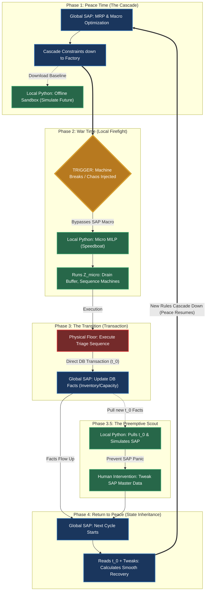

<!-- MIRROR: auto-synced from notes/projects/mrp/supply-planning/frameworks/Two_Dials_Framework.md - do not edit directly. Edit the canonical file in the notes repo and run scripts/sync_project_docs.py -->

---
id: projects-mrp-supply-planning-frameworks-Two_Dials_Framework
type: framework
status: draft
dependencies:
  - math/supply-planning/Math_Safety_Stock_Derivation.md
  - math/supply-planning/Math_Supply_Planning_OR_Lexicon.md
tags: []
invariants: []
---
# Two Dials Framework

Enterprise supply chain architecture: **Scale Dial** (scope) and **Time Dial** (horizon) govern when to use macro continuous optimization vs micro combinatorial triage. Includes the peace/war closed-loop workflow between global ERP and local Python digital twins.

## Related Notes

- [../roadmaps/MRP_V2_Roadmap.md](../roadmaps/MRP_V2_Roadmap.md) — cost optimization objective that motivated macro/micro decoupling.
- [../roadmaps/Supply_Planning_Tool_Roadmap.md](../roadmaps/Supply_Planning_Tool_Roadmap.md) — phased Speedboat implementation.
- [../context/SAP_Enterprise_Context.md](../context/SAP_Enterprise_Context.md) — SAP IBP/PP/MM as the global dictator (optional enterprise reference).
- [../../../../math/supply-planning/Math_Supply_Planning_OR_Lexicon.md](../math/Math_Supply_Planning_OR_Lexicon.md) — Z_macro / Z_micro formulations.
- [../../../../math/supply-planning/Math_Safety_Stock_Derivation.md](../math/Math_Safety_Stock_Derivation.md) — infinity clash and optimizer slack variables.

---

Modern enterprise supply chain optimization is governed by two independent axes, or "dials": the **Scale Dial** (Scope) and the **Time Dial** (Horizon). By manipulating these dials, we dictate the exact mathematical boundaries of the Operations Research (OR) solvers.

## **Core Concept: The Fractal Strategy**

The architecture is inherently **fractal**. Whether the Scale Dial is turned all the way up (Global Enterprise) or all the way down (Local Python Script), the **Time Dial strategy remains exactly the same**.

At every scale, the timeline must be decoupled into Macro (Strategic) and Micro (Tactical) models. Attempting to mix strategic continuous variables with granular binary variables results in immediate mathematical collapse.

### **The Cascade Effect: Top-Down Constraint Setting (The MRP II Legacy)**

Planning must flow sequentially from the widest horizon down to the narrowest. Historically rooted in MRP II (Manufacturing Resource Planning) and modern S\&OP, the architecture relies on **Constraint Cascading**.

You cannot optimize the micro without first solving the macro. The horizons interact through a strict parent-child hierarchy:

* **The Boundary Setter (Macro/Liquid Zone):** The optimizer looks at the widest time horizon to solve for aggregate constraints. It determines the total available capacity, authorizes capital for inventory pre-building, and locks in macro labor parameters (e.g., total shift hours).  
* **The Narrowing (Cascading to Micro):** The outputs of the Macro optimizer (the monthly volume targets and labor budgets) are passed downward. As the timeline narrows into the Slushy and Frozen zones, these aggregate targets transform into **hard constraints**.  
* **The Execution (Micro/Frozen Zone):** By the time the timeline narrows to the shop floor, the Micro solver is highly restricted. It no longer worries about *whether* it has enough capital or labor; its only job is to sequence the specific geometries of the orders within the exact boundaries passed down from the Macro layer.

## **Part I: The Need to Split Cost Functions Across Time Horizons**

Before exploring the scales, it is critical to define *why* the Time Dial requires different mathematical objective functions. You cannot use a single "God Matrix" for time because the physical frictions of reality mutate as you zoom in.

### **1\. The Frozen Zone (Operational Horizon: Days 1 to 30\)**

* **The Physics:** The master schedule is mathematically locked. Focus is strictly on execution, triage, specific machine kinematics, and sequencing.  
* **The Cost Function (Friction & Service):**  
  $$ \\min Z\_{micro} \= \\sum\_{i=1}^{N} (C\_{shortage} \\cdot B\_i \+ C\_{setup} \\cdot y\_i \+ C\_{delay} \\cdot D\_i) $$  
  *Note: $C\_{shortage}$ is heavily weighted to prevent critical stockouts at all costs.*

### **2\. The Slushy Zone (Tactical Horizon: Months 2 to 6\)**

* **The Physics:** This is the S\&OP optimization sweet spot. The timeline allows for physical parameter changes (e.g., hiring labor, shifting shifts).  
* **The Cost Function (Capital & Labor):**  
  $$ \\min Z\_{macro} \= \\sum\_{t=1}^{T} (C\_{hold} \\cdot I\_t \+ C\_{cap\_penalty} \\cdot U\_t \+ C\_{overtime} \\cdot O\_t) $$

### **3\. The Liquid Zone (Strategic Horizon: Months 7 to 24\)**

* **The Physics:** The Macro Time-Series Optimizer zone (replacing legacy RCCP). Forecasts are aggregate; the system focuses on long-term inventory banking to survive distant capacity ceilings.  
* **The Cost Function:** Operates using the same macroeconomic variables ($Z\_{macro}$) as the Slushy Zone to balance holding costs against future capacity penalties.

### **4\. The Imperative for Decoupling (The Curse of Dimensionality)**

Mixing continuous state-variables ($I\_t \\in \\mathbb{R}^+$) with discrete structural variables ($y\_i \\in \\{0,1\\}$) over a 24-month horizon creates a massively entangled Mixed-Integer Linear Program (MILP). The computational branching required expands exponentially ($O(2^n)$), creating a black box that a solver cannot resolve in a viable timeframe. Therefore, the cost functions must be strictly isolated by the Time Dial.

## **Part II: The Global Scale Dial (The Legacy Enterprise Waterfall)**

*Note: This represents the traditional, sequential ERP architecture. It is the predecessor to the modern "APS Sandwich" (detailed later), but understanding this legacy waterfall is critical for knowing why older systems fail during localized chaos.*

This is the system of record. The Scale Dial is turned to maximum: it encompasses the entire global network, every SKU, and every factory. In this legacy setup, the time horizons operate in rigid, linear silos.

### **1\. Global Liquid Zone (Strategic Horizon: Months 7 to 24\)**

* **System:** SAP IBP for S\&OP.  
* **Function:** Generates the unconstrained long-term baseline. Runs a high-level global MILP to smooth aggregate volume targets across 1-Month time buckets.  
* **Objective:** Minimizes $Z\_{macro}$ globally (e.g., balancing European warehouse holding costs against Texas supplier capacity ceilings).

### **2\. Global Slushy Zone (Tactical Horizon: Months 2 to 6\)**

* **System:** SAP S/4HANA (Standard MRP / Master Production Schedule).  
* **Function:** Takes the monthly S\&OP buckets and translates them into medium-term supply constraints. **The Legacy Flaw:** It explodes the Bill of Materials linearly here without concurrent capacity checks, risking dead raw material inventory if the factory floor cannot execute the plan.  
* **Objective:** Attempts to minimize $Z\_{macro}$ tactically, bridging global financial targets with regional factory budgets.

### **3\. Global Frozen Zone (Operational Horizon: Days 1 to 30\)**

* **System:** SAP PP/DS (Detailed Scheduling) or local Factory Schedulers.  
* **Function:** Ingests the rigid Monthly/Weekly volume buckets, shatters them into Daily/Hourly buckets via the Time Fence, and runs capacity sequencing.  
* **Objective:** Minimizes $Z\_{micro}$ globally (sequencing the actual physical constraints of the global shop floor).

## **Part III: The Local Scale Dial (The Digital Twin)**

This is your custom architecture. The Scale Dial is turned down to your specific desk: it encompasses only the exact SKUs, machines, and suppliers you are personally responsible for.

By building both a local MRP and a local MILP, you create a **Digital Twin** of the global ecosystem. It perfectly mirrors the Global Scale's fractal time splits, allowing for immediate, offline mathematical prototyping.

**The Connected Graph:** Injected chaos only spreads through two vectors: **Vertical** (shared BOM components) or **Horizontal** (shared machine routing). By isolating these vectors, the solver avoids the curse of dimensionality.

### **1\. Local Frozen Zone (Operational Horizon: Days 1 to 30\)**

* **The Persona:** The Triage Speedboat.  
* **System:** Python MILP (72-Hour to 30-Day Optimizer).  
* **Function:** Ingests the localized, frozen volume target. Resolves acute operational shocks within the locked schedule (e.g., $Cap\_{avail} \\to Cap\_{avail} \- \\Delta\_{breakdown}$).  
* **Objective:** Minimizes $Z\_{micro}$ locally. It answers: *"Machine C just broke. What is the exact mathematical sequence that minimizes shorting hospital orders today without wasting time on setups?"*

### **2\. Local Slushy Zone (Tactical Horizon: Months 2 to 6\)**

* **The Persona:** The Strategic Sandbox.  
* **System:** Python MRP Engine \+ Python MILP (PuLP/C++ Solver).  
* **Function:** Ingests a localized demand file. Calculates the unconstrained baseline locally, then optimizes a mid-term capacity plan by testing variable physical parameters (e.g., authorizing overtime, shifting labor).  
* **Objective:** Minimizes $Z\_{macro}$ locally. It answers: *"If I accept this new supplier contract for my 15 SKUs next quarter, what is the exact holding cost and overtime impact?"*

### **3\. Local Liquid Zone (Strategic Horizon: Months 7 to 24\)**

* **The Persona:** The Scenario Radar.  
* **System:** Python Time-Series Aggregator \+ Python MILP.  
* **Function:** Runs aggregate scenario planning on distant forecasts. Tests structural network changes rather than daily execution (e.g., qualifying a new local supplier, adding a permanent machine).  
* **Objective:** Minimizes $Z\_{macro}$ locally over the long term. It answers: *"Based on aggregate demand trends for my portfolio, do I need to mathematically justify a CapEx request for a new packaging line next year to avoid future capacity penalties?"*

## **Part V: The Mathematics of Triage (Safety Stock vs. Shortage)**

See [Math_Safety_Stock_Derivation.md](../math/Math_Safety_Stock_Derivation.md) (Part 8) for the formal treatment of the **Infinity Clash**, slack variable $V_t$, and stratified penalties ($C_{violation}$ vs $C_{shortage}$).

**Operational summary:** In forecasted demand (Peace Time), $SS_t$ is a rigid buffer target with no near-infinite shortage penalty on statistical tails. In firmed demand / operational chaos (War Time), the solver compares draining the statistical buffer ($V_t$, moderate $C_{violation}$) against missing a physical order (near-infinite $C_{shortage}$) and autonomously sacrifices the buffer to fulfill the firm constraint.

---

# Part VII: The Closed-Loop State-Feedback Architecture

## **III. The State-Feedback Architecture: Executing the Closed Loop**

A deterministic system cannot survive if it assumes its commands are followed perfectly. Physical reality introduces friction (breakdowns, delays, failures) that shatters the top-down plan. The "Closed Loop" is the formal data pipeline that forces the planning algorithm to inherit the physical reality of the floor.

### **The Enterprise Architecture Matrix**

Before the flow chart, here is the exact glossary of your tools:

* **The Environments:**  
  * **Global (SAP):** The slow, massive System of Record.  
  * **Local (Python):** Your agile Digital Twin / Sandbox.  
* **The Math Layers (Present in both environments):**  
  * **MRP:** Explodes the Bill of Materials (Unconstrained).  
  * **Macro (Slushy Zone):** Optimizes continuous capacity and labor over months ($Z\_{macro}$).  
  * **Micro (Frozen Zone):** Sequences exact machine combinatorial math over hours ($Z\_{micro}$).

### **Closed-Loop Flow**

### **Phase 1: Peace Time (The Top-Down Cascade)**

* **The State of the System:** The enterprise timeline stretches forward without acute, localized friction. The system assumes a deterministic future based on the initial state constraints ($t\_0$) established in the previous cycle.  
* **The Logic (The Macro Matrix):** In the absence of immediate physical shock, the mathematical objective is pure capital and capacity optimization. The global system (ERP) executes the Macro solver ($Z\_{macro}$) across the long-term horizon (Months 1 to 24). It operates using continuous variables, balancing inventory holding costs against aggregate capacity ceilings.  
* **The Action (The Cascade):** The outputs of the Macro solver are not merely suggestions; they harden into absolute physical boundaries as time rolls forward. The authorized labor budgets, calculated safety stock targets ($SS\_t$), and aggregate material purchases are cascaded down the hierarchy. By the time these variables reach the operational execution layer, they have transformed from continuous macroeconomic targets into rigid, closed-box constraints.  
* **The Role of the Digital Twin (The Proactive Scout):** During Peace Time, the Local Python architecture does not govern physical execution. Instead, it operates entirely in a simulation capacity.  
  1. **Ingestion:** It passively ingests the officially cascaded baseline from the global system.  
  2. **Stress Testing:** It subjects the long-term baseline to stochastic variations (simulated supplier drops, aggregate demand spikes).  
  3. **Prevention:** If the simulation identifies a mathematical breaking point (e.g., a capacity wall in Month 4), the architect proactively alters a master global parameter (e.g., temporarily elevating a safety stock target). This prevents the bottleneck from ever manifesting in physical reality.

### **Phase 2: War Time (The Combinatorial Triage)**

* **The State of the System:** Physical reality deviates violently from the top-down deterministic plan. An acute physical shock (machine failure, supply blackout) instantly deletes a segment of available capacity ($Cap\_{avail}$) or inventory ($I\_t$).  
* **The Logic (The Macro Blindness):** The global ERP is mathematically incapable of surviving this moment. Its objective function ($Z\_{macro}$) is designed for continuous variables over months, not discrete combinatorial sequencing ($y\_i \\in \\{0,1\\}$) over hours. Attempting to force the global solver to recalculate the immediate recovery introduces severe system nervousness and computationally times out due to NP-hard complexity.  
* **The Action (The Local Speedboat):** 1\. **Isolation:** The affected local node effectively severs itself from the macro plan. The global cascade is temporarily suspended for that specific node.  
  2\. **Activation:** The Local Micro solver ($Z\_{micro}$) boots up. It inherits the exact physical constraints of the moment (the remaining functional machines, the actual on-hand inventory).  
  3\. **The Math of Survival:** The solver is subjected to the "Infinity Clash." It must satisfy a firm constraint (a required physical order) under a near-infinite shortage penalty ($C\_{shortage}$). To prevent unbounded optimization failure, the algorithm activates the slack variable ($V\_t$). It mathematically weighs the soft penalty of draining the statistical safety stock ($C\_{violation}$) against the hard penalty of failing the physical order.  
* **The Output:** The Micro solver autonomously sacrifices the statistical buffer to satisfy the physical constraint. It outputs a strictly executable, highly efficient kinematic sequence for the surviving machinery to stop the immediate operational bleeding. The acute time window (Hours 1 to 72\) is locked and executed.

### **Phase 3: The Transaction (Physical-to-Digital Synchronization)**

* **The State of the System:** The localized operational fire has been fought using the Micro solver ($Z\_{micro}$). To survive the acute physical constraint, the mathematical triage required draining the safety stock buffer ($V\_t$) or halting a machine setup ($y\_i$).  
* **The Logic:** At this moment, the global ERP is entirely blind. It still mathematically believes the original plan is intact. If the system rolls forward without synchronizing, the global solver will build future plans on a false foundation.  
* **The Action (Bottom-Up Flow):** The operator bypasses local Python planning tools and transacts the physical aftermath directly into the global execution database.  
* **The Flow Mechanism:** The operator logs two distinct data vectors:  
  1. **Inventory Degradation:** Deducting the physical units from the system of record.  
  2. **Capacity Contraction:** Registering the exact duration of offline machinery.  
* **The Output:** The global database now holds the true **Initial State Constraint ($t\_0$)** for the next planning horizon.

### **Phase 3.5: The Preemptive Scout (Algorithmic Damage Assessment)**

* **The State of the System:** The global database is updated, but the global solver (the macro ERP batch run) is asleep. It will not process the new $t\_0$ until its scheduled overnight run.  
* **The Vulnerability:** Global Macro solvers are ruthless, deterministic engines. When the ERP wakes up and sees the safety stock target ($SS\_t$) has been violated, its objective function ($Z\_{macro}$) will mathematically force an immediate recovery. It may autonomously execute a violent schedule tear-down—delaying critical client orders simply to satisfy the mathematical rule of "refill the buffer at all costs."  
* **The Logic:** You cannot allow a massive algorithm to calculate a recovery path unsupervised. You must preview the mathematical damage.  
* **The Action (The Scout):** 1\. **Extract:** Pull the newly updated $t\_0$ constraints from the ERP into the Local Python Digital Twin.  
  2\. **Simulate:** Run the Local Macro MILP ($Z\_{macro}$) offline to instantly preview exactly what the global ERP is going to do when it wakes up.  
  3\. **Analyze:** Identify the structural bottlenecks. Does the solver demand impossible overtime? Does it break critical constraints further down the timeline?  
* **The Human Intervention (Parameter Manipulation):** If the Local Scout reveals that the algorithm's recovery path is too violent, the architect alters the master data rules *before* the global solver runs. By artificially lowering the $SS\_t$ parameter temporarily in the ERP, the architect mathematically forces the global solver to schedule a smooth, multi-month recovery rather than a panicked, immediate reaction.

### **Phase 4: The Global Recalibration (State Inheritance)**

* **The State of the System:** The enterprise system initiates its standard planning cycle.  
* **The Logic:** The system is no longer operating on forecasts; it is operating on inherited facts. The loop officially closes when the top-down planning engine is forced to acknowledge the bottom-up physical reality.  
* **The Action:** The global MRP and S\&OP layers execute.  
  1. The MRP engine reads $t\_0$ and explodes the net requirements against the depleted inventory.  
  2. The Macro MILP processes the newly restricted capacity parameters.  
  3. The algorithm calculates the most efficient $Z\_{macro}$ path to restabilize the network based on the manipulated constraints set by the architect during the Scout phase.  
* **The Output:** A mathematically verified, physically possible recovery plan is locked in. The new labor limits and volume boundaries cascade downward, resetting the constraints for the local Micro solvers. The system transitions back to routine Peace Time operations.

---

## **IV. System Governance: Dictators vs. Scouts**

The architecture demands strict separation between the master database and the algorithmic simulators to maintain data integrity.

* **The System of Record (The Global ERP):** This is the master ledger. It holds the official truth. It runs the massive, slow-moving macro batches. It is the dictator of the enterprise.  
* **The Digital Twin (The Local Micro-Engines):** These are isolated, highly responsive algorithms built to mirror the ERP's logic.  
  * **As a Scout (Peace Time):** They ingest the baseline facts from the ERP to run highly accelerated, offline Monte Carlo simulations. They hunt for distant, mathematical bottlenecks so human architects can proactively adjust the ERP's master parameters.  
  * **As a Speedboat (War Time):** When chaos strikes, they bypass the ERP entirely to run immediate combinatorial triage on localized data. They output the survival sequence, allowing human operators to transact the physical aftermath directly back into the ERP ledger.

---

# **Executive Summary: The Closed-Loop State-Feedback Architecture**

**Core Concept:** Modern enterprise supply chains cannot be optimized using a single continuous time-horizon due to the curse of dimensionality and the NP-hard nature of localized machine sequencing. This architecture decouples the **System of Record (Global SAP)** from the **Digital Twin (Local Python)**. It operates as a continuous, closed loop where strategic plans cascade top-down, and physical reality flows bottom-up, ensuring the enterprise algorithm always inherits the true state of the factory floor.

### **Phase 1: Peace Time (The Top-Down Cascade)**

*The system is stable. The Global ERP acts as the Enterprise Dictator.*

* **Global SAP (Execution):** Runs the massive overnight Master Resource Planning (MRP) and Macro $Z\_{macro}$ optimization math. It calculates the baseline schedule and cascades rigid boundaries (labor budgets, required volume) down to the factory floor.  
* **Local Python (The Scout):** Operates purely offline. It passively downloads the SAP baseline to run proactive Monte Carlo simulations, hunting for distant supply bottlenecks before they happen in reality.

### **\[ THE TRIGGER \]**

*A local node fails (e.g., Catastrophic Machine Breakdown). Chaos is injected into the physical floor. The Global SAP battleship is too slow to calculate an immediate combinatorial response.*

### **Phase 2: War Time (The Immediate Local Firefight)**

*The local node severs from the macro plan to survive the acute bottleneck.*

* **Local Python (The Speedboat):** Bypasses the Global ERP and Local Macro tools entirely. The Local Micro MILP boots up, ingesting the new physical constraints (offline machinery).  
* **The Math ($Z\_{micro}$):** The solver executes localized, combinatorial triage. It autonomously sacrifices the statistical buffer (Safety Stock) to save firmed hospital orders, outputting an exact, executable machine sequence to stop the bleeding.

### **Phase 3: The Transition (Short-Circuiting to the Database)**

*The physical floor executes the triage. Reality must now synchronize with the digital ledger.*

* **The Physical Floor:** Executes the Micro Python sequence. The immediate crisis is managed.  
* **Global SAP (The Transaction):** The operator manually bypasses planning tools and executes a direct physical transaction in the SAP database.  
  * *Fact 1:* Deduct the consumed inventory.  
  * *Fact 2:* Log the exact duration of offline machinery.  
* **State Inheritance:** The Global ERP database now holds the true **Initial State Constraint ($t\_0$)** for the next phase.

### **Phase 3.5: The Preemptive Scout (Algorithmic Damage Assessment)**

*The global database is updated, but the SAP algorithm is asleep. The operator must preview the damage.*

* **Local Python (The Simulator):** Extracts the new $t\_0$ facts from SAP. The Local Python Macro script runs an offline simulation of SAP’s upcoming overnight batch.  
* **The Assessment:** The operator previews how SAP will react to the missing inventory. If SAP’s mathematical recovery is too violent (e.g., unnecessarily delaying VIP orders to instantly rebuild stock), the operator executes a **Human Intervention**.  
* **The Adjustment:** The operator manually tweaks master data parameters in SAP (e.g., temporarily lowering the Safety Stock target) so the algorithm is forced to calculate a smooth, multi-month recovery rather than a panicked reaction.

### **Phase 4: Return to Peace (State Inheritance)**

*The Global ERP wakes up and recalibrates based on physical reality.*

* **Global SAP (The Awakening):** SAP initiates its standard weekly batch run. It reads the new $t\_0$ database constraints (missing inventory) and the smoothed parameters set by the operator during Phase 3.5.  
* **The Recalibration:** SAP realizes it is operating at a deficit. It automatically authorizes the necessary macro recovery plan (e.g., scheduling weekend overtime for Month 2\) to rebuild the network.  
* **The Loop Closes:** The newly calculated recovery rules cascade down to the factory floor, resetting the boundaries for the local Micro solvers. **Peace Time resumes.**

> See the [Closed-Loop Flow](#closed-loop-flow) diagram above for the full peace → war → transaction → scout → recalibration cycle.

## **Part II: The Modern Global Scale Dial (The APS Sandwich)**

This is the modern system of record. The Scale Dial is turned to maximum: it encompasses the entire global network, every SKU, and every factory. Instead of the linear legacy waterfall, it uses an optimization "Sandwich" to prevent stranding capital in dead raw material inventory.

### **Layer 1: Top Bread (Unconstrained Baseline)**

The business generates a purely statistical or sales-driven forecast target for Finished Goods only. It is completely blind to factory constraints.

### **Layer 2: The Meat (The APS Optimizer)**

SAP IBP runs the LP/MILP solver at the Finished Good level. It checks actual factory capacity ceilings and mathematically pre-builds, delays, or shifts the Finished Goods schedule until it is 100% physically feasible.

### **Layer 3: Bottom Bread (The MRP Material Explosion)**

SAP S/4HANA takes the now-locked, feasible Finished Goods schedule and explodes the Bill of Materials. Because the input schedule is mathematically verified by Layer 2, the MRP engine only purchases exact raw components (screws, packaging, etc.) that the factory is actually capable of consuming.

### **Layer 4: The Plate (Return to Legacy Execution)**

*The critical insight:* Once the BOM is exploded in Layer 3, the system hands the reigns back to the traditional execution flow. Purchasing cuts the supplier POs for the raw materials, and the PP/DS Detailed Schedulers (The Frozen Zone) take over to sequence the exact daily machine kinematics.
